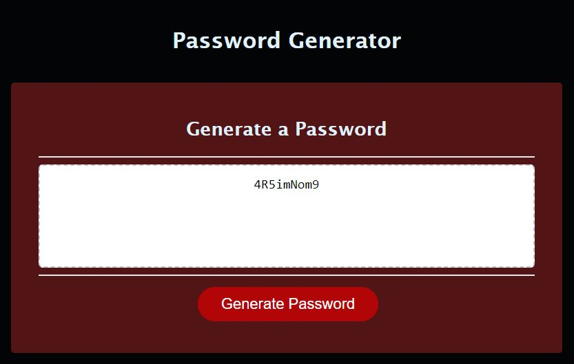

# Nux Generatio XX

## URL: https://daniellesison.github.io/nux-generatio-xx/

## Description

This webpage utilizes a script for random password generation within the Acceptance Criteria:

<ol>
    <li>A functioning "Generate" button to initiate a window prompt for the following password values - </li>
        <ul>
        <li>Length: 8 - 128 characters</li>
        <li>Character Types: Special Characters, Numbers, Lowercase letters, Uppercase letters.</li>
        </ul>
    <li>Each prompt must be validated after each user category prompt choice.</li>    
    <li>The generated password must meet the chosen criteria of the user.</li>
    <li>Lastly, it must display a random generated password within the text area.</li>    
</ol>

## Installation

N/A

## Page Preview

## Usage

The following instructions must be followed to navigate the generator:

<ol>
<li>Upon visiting the password generator click the Generate Password button within the page. </li>

<li>Type in a length preference as directed by the window prompt, and click OK: (You will be alerted to choose again if; you click the CANCEL button, or your selection is not within the options.)

</li>

<li>Click OK for each character type needed, as directed by the window prompt: (This step will also be validated like Step 2) </li>

<li>Random password will be generated within user's acceptance criteria.

## Credits

Credits to the following content below that served as a basis for the developer:

JavaScript Guide - https://www.w3schools.com/java/default.asp

Random Password Generator using JavaScript - https://dev.to/code_mystery/random-password-generator-using-javascript-6a (Posted by: "Foolish Developer", https://dev.to/code_mystery)

README tutorial - https://coding-boot-camp.github.io/full-stack/github/professional-readme-guide

## License

N/A
